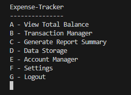

# expense-tracker

## Technologies Used

- Programming Language: Java
- Dependency Management: Apache Maven
- Database: MySQL

## Features
- Add, edit, and delete transaction: Users can manage individual transactions with full CRUD (Create, Read, Update, Delete) operations.
- View Total Balance: Get an instant summary of your account's financial status.
- View Recent Transactions with filter options (date, amount, source and category)

## Setup Instructions
1. Clone the repository:
git clone https://github.com/yourusername/expense-tracker.git

Navigate to the project directory:
cd expense-tracker

2. Set up the datatbase
Ensure you have MySQL installed on your system. You can download it from https://dev.mysql.com/downloads/installer/
Create a new MySQL schema for the application. CREATE DATABASE expense_tracker;
Navigate to the sql-queries folder in the repository and execute the provided SQL file to create the necessary tables: 
expense_tracker/sql_queries/sql-queries.sql

3. Configure the environment variables:
Set up the following environment variables with your MySQL credentials:

Windows: Search for "Environment Variables" and add the following:
Add new environment variables using the crendentials of your mysql
- MYSQL_username=yourusername
- MYSQL_password=yourpassword
- MYSQL_hostname=yourhostname
- MYSQL_schema=expense_tracker

Mac/Linux: Add these lines to your .bashrc or .zshrc file:
- export MYSQL_username=yourusername
- export MYSQL_password=yourpassword
- export MYSQL_hostname=localhost
- export MYSQL_schema=expense_tracker
Then, reload the file: source ~/.bashrc

## Application Terminal Interface

## Contributing
Contributions are welcome! Please feel free to fork the repository, open issues, or submit pull requests.
